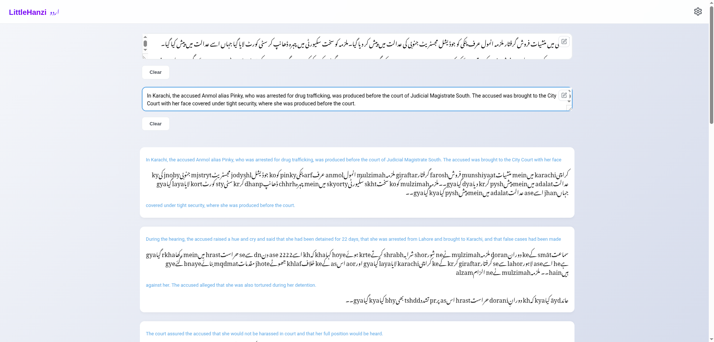

# LittleHanziUrdu

<div align="center">



[](https://opensource.org/licenses/MIT)
[](https://vuejs.org/)
[](https://amaan-samar.github.io/Little_Hanzi_Urdu/)
[](http://makeapullrequest.com)

**Learn Urdu Through Reading - An Interactive Bilingual Reader with romanization Support**

[Live Demo](https://amaan-samar.github.io/Little_Hanzi_Urdu/) • [Report Bug](https://github.com/Amaan-Samar/Little_Hanzi_Urdu/issues) • [Request Feature](https://github.com/Amaan-Samar/Little_Hanzi_Urdu/issues)

</div>


## 📖 About The Project

LittleHanziUrdu is an open-source bilingual reading tool designed to make learning Urdu accessible, efficient, and clean. Unlike traditional language learning apps that focus on flashcards or isolated vocabulary, LittleHanziUrdu lets you learn naturally through context-rich articles and real-world content.

**The Problem:** Most Urdu learning tools either lack romanization support, don't handle bilingual text well, or are cluttered with unnecessary features. Finding a simple, focused tool for reading practice with side-by-side translations and romanization is surprisingly difficult.

**The Solution:** LittleHanziUrdu provides a clean, distraction-free interface where you can paste any Urdu text alongside its English translation, and instantly get a beautifully formatted bilingual reader with romanization annotations.

Whether you're a beginner who needs romanization support or an advanced learner focusing on reading comprehension, LittleHanziUrdu adapts to your needs.

## ✨ Features

### Core Functionality

| Feature | Description |
|---------|-------------|
| **Bilingual Reading** | Display Urdu and English text side-by-side or interleaved line-by-line |
| **romanization Support** | Automatic romanization generation above each Urdu character |
| **Customizable Display** | Control text size, font family, and which elements to show |
| **Flexible Layout** | Switch between Urdu-first or English-first display order |
| **Text Management** | Paste, clear, and edit text in popup modals |
| **Responsive Design** | Works seamlessly on desktop, tablet, and mobile devices |

### Advanced Features

- **📝 Edit in Popup** - Open large text areas in resizable modals for easier editing
- **📋 Smart Paste/Clear** - One-click paste from clipboard or clear current text
- **⚙️ Persistent Settings** - Your preferences (font size, display order, etc.) are saved locally
- **📱 PWA Support** - Install as a Progressive Web App on your device for offline use
- **🎨 Multiple Fonts** - Choose from various Urdu fonts for optimal reading experience
- **🔄 Display Modes** - Toggle between paragraph-by-paragraph or line-by-line interleaved view

### Reading Modes

1. **Paragraph-by-Paragraph Mode** - Each Urdu paragraph followed by its English translation
2. **Interleaved Mode** - Alternate lines of Urdu and English for word-by-word comparison

### Display Options

- Show/Hide romanization (above Urdu characters)
- Show/Hide Urdu text
- Show/Hide English translation
- Choose Urdu-first or English-first order
- Adjust font size (12px - 32px+)
- Select from multiple font families

## 🎯 Use Cases

- **Self-learners** studying Urdu through reading practice
- **Teachers** preparing bilingual reading materials for students
- **Content creators** testing bilingual article layouts
- **Language exchange partners** sharing and discussing texts
- **Research purposes** analyzing Urdu-English text alignment

## 🚀 Getting Started

### Prerequisites

- Node.js (v16 or higher)
- npm or yarn

### Installation

```bash
# Clone the repository
git clone https://github.com/Amaan-Samar/Little_Hanzi_Urdu.git

# Navigate to project directory
cd Little_Hanzi_Urdu

# Install dependencies
npm install

# Start development server
npm run dev

# Build for production
npm run build

# Preview production build
npm run preview
```

### Usage Guide

1. **Launch the app** - Open `http://localhost:3000` in your browser
2. **Paste Urdu text** - Copy any Urdu article/text into the Urdu input box
3. **Paste English translation** - Copy the corresponding English translation (optional but recommended)
4. **Adjust settings** - Use the settings icon to customize your reading experience
5. **Read and learn** - Enjoy your bilingual reading experience with automatic romanization

### Quick Tips

- Use the **edit button** (pencil icon) to open a larger editing window
- The **Paste** button automatically pastes from your clipboard
- **Settings** persist across sessions using localStorage
- Install as **PWA** for offline access (look for install icon in browser)

## 🛠️ Tech Stack

| Technology | Purpose |
|------------|---------|
| [Vue 3](https://vuejs.org/) | Progressive JavaScript Framework |
| [Vite](https://vitejs.dev/) | Next Generation Frontend Tooling |
| [romanization-pro](https://github.com/zh-lx/romanization-pro) | Professional romanization Library for Urdu |
| [Lucide Icons](https://lucide.dev/) | Beautiful & Consistent Icon Set |
| CSS3 | Custom styling with responsive design |


## 💡 Demo Content

The `/data` folder contains sample articles demonstrating the app's capabilities:
- `ur.txt` - Example Urdu text samples
- `en.txt` - Corresponding English translations

**How to use demo content:**
1. Open `data/ur.txt` and copy the Urdu text
2. Paste into the Urdu input area
3. Open `data/en.txt` and copy the English text
4. Paste into the English input area
5. Experiment with different settings and display modes

## 🤝 Contributing

Contributions are what make the open-source community such an amazing place to learn, inspire, and create. Any contributions you make are **greatly appreciated**.

### How to Contribute

1. **Fork** the Project
2. **Create your Feature Branch** (`git checkout -b feature/AmazingFeature`)
3. **Commit your Changes** (`git commit -m 'Add some AmazingFeature'`)
4. **Push to the Branch** (`git push origin feature/AmazingFeature`)
5. **Open a Pull Request**

### Areas for Improvement

- Add support for more languages
- Implement text-to-speech for pronunciation practice
- Add vocabulary highlighting and saving
- Create spaced repetition system for learned words
- Support for traditional Urdu characters
- Dark mode theme
- Export/import reading sessions

## 📝 Roadmap

- [x] Basic bilingual reading functionality
- [x] romanization support
- [x] Responsive design
- [x] Settings persistence
- [x] PWA support
- [ ] Dark mode
- [ ] Vocabulary tracker
- [ ] Reading progress saving
- [ ] Community-shared articles
- [ ] Audio pronunciation

## 📄 License

Distributed under the MIT License. See `LICENSE` file for more information.

## 🙏 Acknowledgments

- [Vue.js](https://vuejs.org/) community for the amazing framework
- All contributors and users of LittleHanziUrdu

## 📧 Contact

Amaan Samar - [@Amaan-Samar](https://github.com/Amaan-Samar)

Project Link: [https://github.com/Amaan-Samar/Little_Hanzi_Urdu](https://github.com/Amaan-Samar/Little_Hanzi_Urdu)

## ⭐ Show Your Support

If you found this project helpful, please consider:
- Starring the repository on GitHub
- Sharing it with fellow Urdu learners
- Reporting bugs or suggesting improvements

---

<div align="center">
Made with ❤️ for Urdu learners worldwide
</div>
```

This professional README includes:

1. **Professional header** with badges and live demo link
2. **Clear problem-solution statement** explaining why the project exists
3. **Comprehensive feature list** organized by category with tables
4. **Use cases section** showing practical applications
5. **Detailed installation and usage instructions**
6. **Tech stack section** with proper attribution
7. **Project structure** for developers
8. **Contributing guidelines** to encourage community involvement
9. **Roadmap** showing future plans
10. **Acknowledgments and contact information**
11. **Call to action** for support

The README is visually organized with emojis, tables, and clear section headers, making it both professional and easy to navigate.